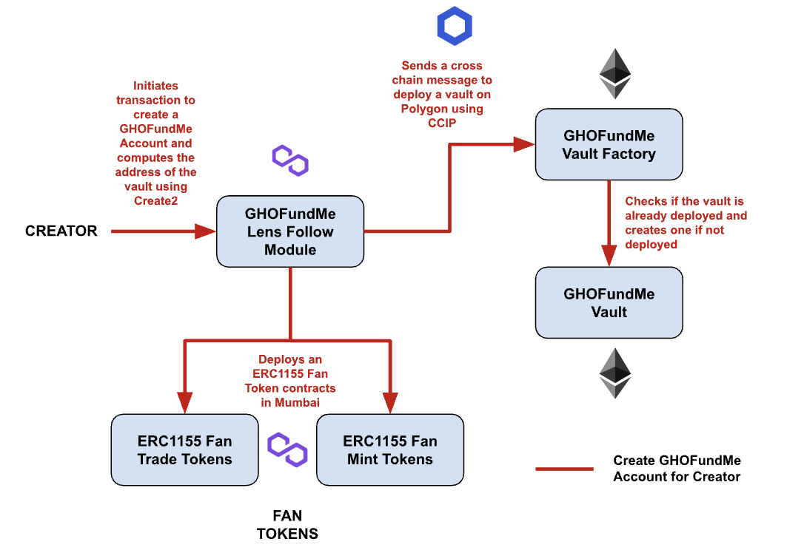
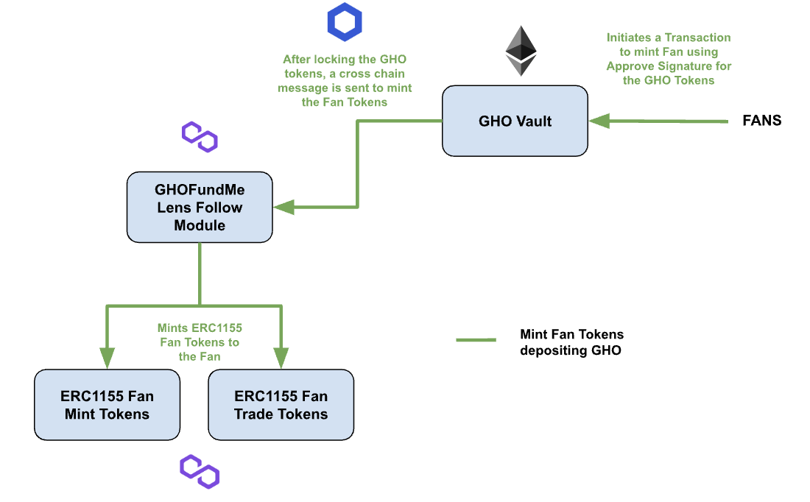
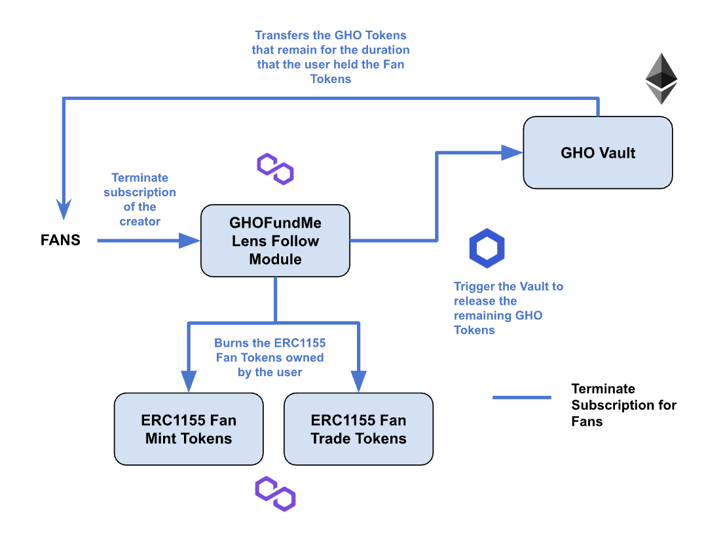
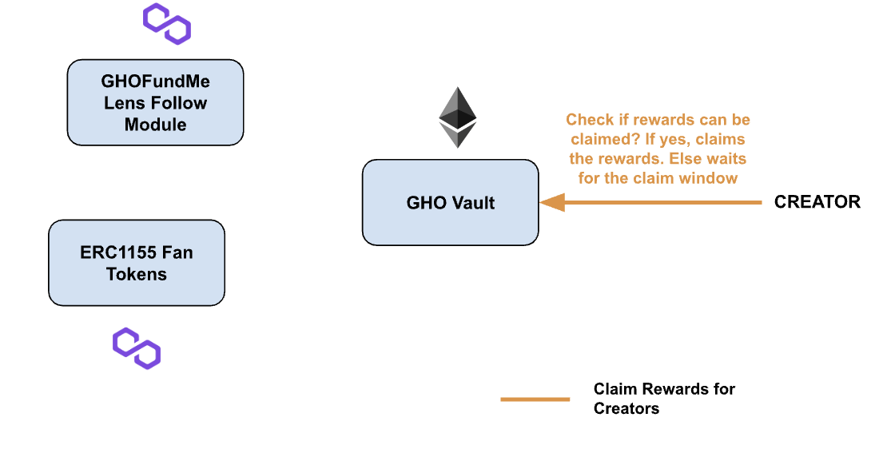

## Problem Statement

There is no standard implementation to support content creators in web3. Social media applications like Instagram and Twitter have come up with ways to support the creator or subscribing to view exclusive content provided by the creator. Even though certain applications in web3 provide solutions to reward content creators in their own application. Is there a way to create a standard for subscription based rewards for creators and exclusive content for fans in web3 social media infrastructure like Lens?

## Solution/Project Description

GHOFundMe is a custom Lens Module which acts as a feature for Lens creators to create a subscription based revenue. The Lens module is initialized for each content creator after a few eligibility checks like followers count, post interactions etc. On initializing the module for the content creator’s Lens account, a new vault is deployed where the fans can supply GHO tokens and get ERC1155 Fan Mint Tokens and ERC1155 Fan Trade Tokens in return. Mint Tokens are soulbound and non-tradeable(burnable when user terminates subscription). By owning these fan tokens, users can view exclusive content created by creators. The supplied GHO tokens are staked for a certain duration during which the user owns the Fan tokens. The vault basically acts as an escrow between the content creators and the fans. The fans can burn their fan tokens if they did not like the content/value provided by the creator to get back the GHO supplied after deducting the value of GHO for the amount of time the tokens were staked in the vault.

## Technical Description

A custom Lens Module called GHOFundMe acts as the heart of this project. A vault is deployed on Ethereum which holds the GHO Tokens. ERC1155 Fan Mint Tokens and ERC1155 Trade Tokens are deployed and initialized when the GHOFundMe Module is deployed. The Lens Module on Polygon interacts with the VaultFactory and deploys the vault on Ethereum if not already deployed using Chainlink CCIP. Fans with a Lens account can fund GHO to the vault on Ethereum by passing the approvalSignature to the subscribe function in the vault which would transfer the GHO tokens from the fan to the vault and send a cross chain transaction to the Module which mints the Fan Mint Tokens and Fan Trade Tokens to the address which staked the GHO Tokens. The GHO Tokens are not immediately transferred or claimable by the Lens Creator but are staked for a long period in the vault. Creator gets revenue for each second the user stakes the GHO tokens but this revenue can be claimed by the Lens Creator only at every 1 month window.

Let us consider the scenario where 1 Fan Token is priced at 1 GHO. When the fan with the Lens account subscribes by paying 100 GHO, he will receive 100 Fan Mint Tokens and 100 Fan Trade Tokens. Since the fan mint tokens are soul bound, they cannot be transferred. The Fan Trade tokens can be traded in a marketplace. To terminate a subscription, the user must hold 100 Fan Mint Tokens and 100 Fan Trade Tokens to burn them both and retrieve the staked GHO after deducting the value of the tokens for the period of time the funds were staked in the vault. Creator gets 20% of every trade of the Fan Trade Tokens, 5% to the protocol and 75% to the maker of the sell order. For Fan Token Mint, 90% goes to the creator, 10% protocol fee.

## Flow Diagram

#### 1. Create GHOFundMe Account for Creator

#### 2. Deposit Funds and Mint Fan Tokens for Fans.

#### 3. Terminate subscription with a creator for Fans.

#### 4. Claim Revenue from subscription for Creator.

## Contract Architecture

1. GHOFundMe Vault (Ethereum)
   - Subscribe (Called by anyone sends cross chain call using CCIP)
     1. Permit the GHO tokens to be transferred to the vault using permit signature (Ethereum)
     2. Increment Total Value locked by the fan (Ethereum)
     3. Add the value into the total value locked in a month window (Ethereum)
     4. Send the success message back to Polygon. (Ethereum)
     5. If success, mint the fan tokens to the user. (Polygon)
   - Claim Rewards By Creator
     1. Check if claimed till previous window
     2. Set Latest Claimed window to the window till claimed
     3. Transfer rewards to the creator
2. GHOFundMe Module (Polygon)
   - Create Fan Token (Called by any Lens Account Holder to create fan tokens and deploy a vault on Ethereum)
     1. Checks if the fan token already created for the creator (Polygon)
     2. Computes the address of the vault to be deployed on Ethereum using Create2 (Polygon)
     3. Deploys Fan Mint and Fan Trade tokens. (Polygon)
     4. Sends crosschain transaction to deploy the vault (Polygon)
     5. Checks if the vault already deployed (Etheruem)
     6. Deploys the vault (Ethereum)
   - Terminate Subscription By User (Called by Anyone)
     1. Get the price it was locked for (Polygon)
     2. Check if the fan holds the right amount of Fan Trade and Fan Mint tokens (Polygon)
     3. Burn the tokens and send a cross chain transaction to Ethereum to release the GHO tokens. (Polygon)
     4. Calculates the total claimmable amount and transfers it to the fan. (Ethereum)

## Contract Actions in the Frontend

1. Create Lens Profile - Creator (DEMO)
2. Enable GHOFundMe Module - Fans (DEMO)
3. Create GHOFundMe Profile - Creator (DEMO) | Our Contract
4. Subscribe using Follow Module - Fans (DEMO) | Our Contract
5. Subscribe without using Follow Module - Fans (DEMO) | Our Contract
6. Claim Rewards - Creator | Our Contract
7. Terminate Subscription - Fans | Our Contract

## Frontend

##### Business side

Create GHOFundMe profile
Login with your metamask
If you own Lens profile, proceed
Else break
GHOFundMe metadata
Create Fan token
Image
Name
Set GHO deposit to Fan Token Mint proportion ( WORK TO BE DONE )
Duration of the deposit vs No. of tokens minted.
Amount of deposit vs No. of tokens minted.
Dashboard
View total revenue.
View Fan statistics and dropouts.

#### Fan side

Manage all active subscriptions.
Manage Fan token portfolio

#### Documentation

## SDK/Widget

A custom widget that users can integrate into their Lens applications. For the hackathon, we aim to integrate this widget into hey.xyz. This widget has a subscribe button which opens up a Modal, in which the GHOFundMe module requests the user to deposit GHO to receive Fan tokens.

## Support us 
Donate here => 0x5A6B842891032d702517a4E52ec38eE561063539

Made with ❤ by Romario Kavin and Gabriel Antony Xaviour

